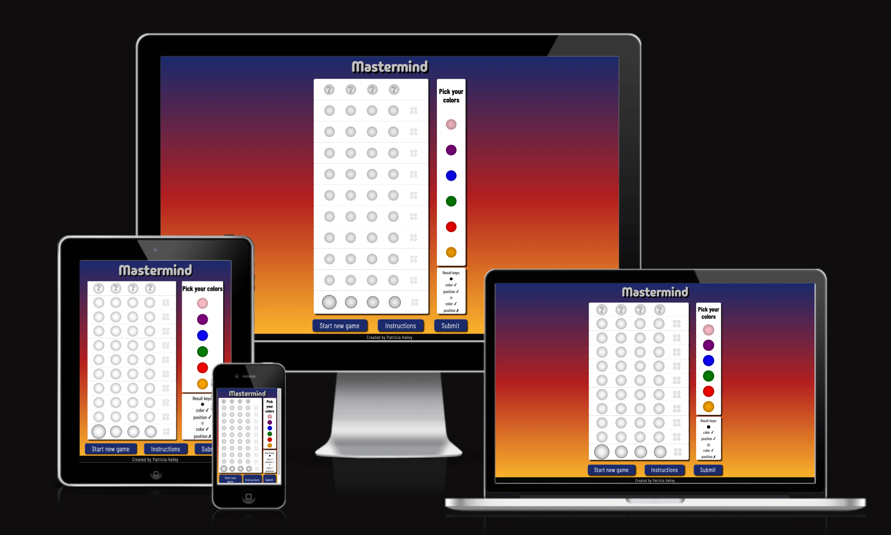
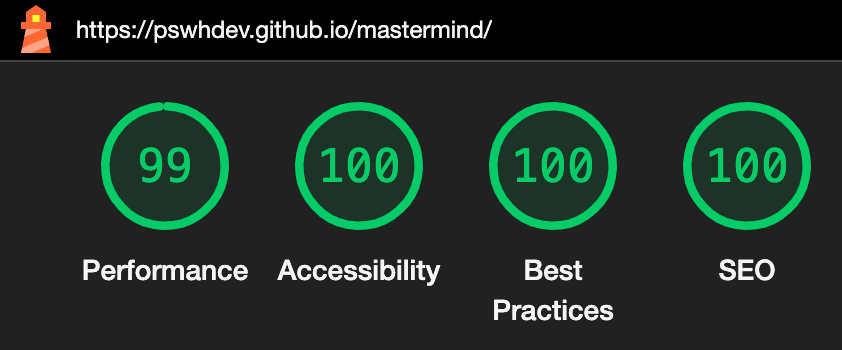
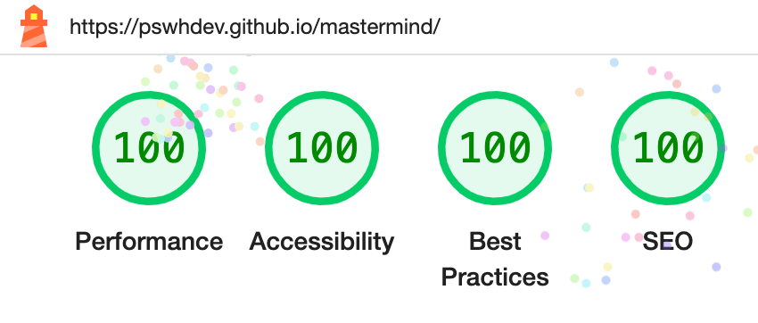

# Mastermind - Testing

Testing was conducted continuously throughout the entire development. I have used Replit to test my logical functions before implementing them on the code. I also used Chrome Developer Tools extensively during the building process to identify and address any issues.

The responsivness testing was conducted in different browsers, computers and mobile devices of different sizes and models to ensure the game can be played in diverse platforms.

Visit the deployed site: [Mastermind](https://pswhdev.github.io/mastermind/)

## CONTENTS

1. [Automated Testing](#automated-testing)
    - [Responsiveness Test](#responsiveness-test)
    - [W3C Validator](#w3c-validator)
    - [JavaScript Validator](#javascript-validator)
    - [Lighthouse](#lighthouse)
2. [Manual Testing](#manual-testing)
    - [Testing User Stories](#testing-user-stories)
    - [Full Testing](#full-testing)

## Automated Testing

### Responsiveness Test

- Responsiveness tests were conducted manually by accessing the live website using different computers, browsers, and mobile devices.

- The website is fully responsive, resizing the content of all pages according to the device's screen sizes, as can be seen in the images below.

- The game page:

### W3C Validator

[W3C](https://validator.w3.org/) was used to validate the HTML on all pages of the website. It was also used to validate the CSS.

- HTML:

  - No errors were returned when passing through the official W3C validator:

    - [W3C Result](https://validator.w3.org/nu/?doc=https%3A%2F%2Fpswhdev.github.io%2Fmastermind%2F)

- CSS:

  - No errors were found when passing through the official [Jigsaw result](https://jigsaw.w3.org/css-validator/validator?uri=https%3A%2F%2Fpswhdev.github.io%2Fmastermind%2F&profile=css3svg&usermedium=all&warning=1&vextwarning=&lang=en)

### JavaScript Validator

[jshint](https://jshint.com/) was used to validate the JavaScript.

- [script.js](documentation/jshint_result.png) passed with a message indicating that one variable was reported as not being used, despite being utilized.

### Lighthouse

The page was tested using the Lighthouse feature in Dev Tools from Google Chrome. The results can be seen in the pictures below. The picture with a black background show the results of tests conducted for the desktop version, whereas the ones with a white background show the results of tests for the mobile version:

- Home page:

## MANUAL TESTING

### Testing User Stories
- Expectation:
As a player, I want to be able to easily find the instructions so that I can understand the game.
- Result:
The "Instructions" button is conveniently located beneath the gameboard, alongside the "Restart" and "Submit" buttons. Upon clicking this button, a popup window appears, presenting the instructions in a clear and concise manner.
- Expectation:
To be able to restart a new game at any time.
- Result:
The "Restart" button is situated beside the "Instructions" button. When clicked, it clears the entire game board, initiating a new game session without requiring a page refresh.
- Expectation:
To be able to easily select the colors I want to pick.
- Result:
The color palette is positioned adjacent to the gameboard, allowing users to select colors by directly clicking or touching their desired color.
- Expectation:
To be able to easily change the color of any "peg" before submitting, but after having chosen the colors of the current row.
- Result: To select a peg, simply click or touch the "peg" on the active row, which is distinguished by dark circles. This can be done regardless of whether a color has already been chosen for the peg. Moreover, you can change the color by selecting a different one from the color palette.
- Expectation: Understand the result keys after each round without having to check any other place.
- Result:
Below the gameboard, there is an easy-to-read guide explaining how to interpret the computed result keys, ensuring a clear understanding of the results.

### Full Testing

Full testing was performed on the following devices:
- Desktop:
    - Monitor: LG - Flatron W2243S 1920x1080
- Laptop:
    - Macbook Air 13 inch screen
- Tablet:
    - Galaxy Tab S6 Lite
- Mobile Devices:
    - iPhone 12 mini
    - Galaxy Note20

The WebApp was tested on the following browsers:
- Google Chrome
- Safari
- Firefox

| Feature                  | Expected Outcome                                        | Testing Performed                                  | Result                                                | Pass/Fail |
|--------------------------|---------------------------------------------------------|----------------------------------------------------|-------------------------------------------------------|-----------|
|Color palette	|	Changes the color of the selected "peg" on the active row.	|	Clicked or touched on the color.	|	Changed the color of the selected "peg" on the active row.	|	 Pass 
Color palette - hover effect 	|	The colors scale up when hovered over.	|	Moved the mouse over the colors.	|	The colors scaled up when hovered over.	|	 Pass 
Color spacing	|	To be able to choose one color without touching the others.	|	Touched the colors one at a time.	|	The correct color could be chosen without any problems.	|	 Pass 
"Secret code" row	|	To be invisible during the game and visible at the end, regardless of the player winning or losing.	|	Observed to see if the expected outcome would occur upon winning and losing.	|	Remained invisible during the game and became visible at the end, regardless of whether the I won or lost.	|	 Pass 
Curent "guess" row	|	On the current row being played (active row), the "peg" positions are marked with a darker circle around them.	|	Observed if the current row has the dark circle around the "peg" positions.	|	The "peg" positions were marked with a darker circle around them when the row was the current one being played.	|	 Pass 
Current "peg"	|	To be slightly enlarged for easy identification.	|	Observe if the selected "peg" is slightly larger than the others when automatically selected, and if clicked on another peg, observe if that one would be enlarged and the other one would go back to normal size.	|	Was slightly larger than the other "pegs" .	|	 Pass 
Result keys	|	To be shown accordingly to the computed result, allowing the player to understand their guess result.	|	I set the secret code to visible (#secret {visibility: visible;}) and the dummy row that covers the  color sequence to hidden (#codeTop {visibility: hidden;}) and observed the results computed in comparison with the color sequence that I was choosing.	|	They were correctly shown, according to the computed result.	|	 Pass 
"Instructions" button	|	Opens a popup window with the instructions.	|	Clicked or touched on the "Instructions" button.	|	Opened a popup window with the instructions.	|	 Pass 
"Close" button - all popup windows	|	Closes the popup window and returns to the main screen.	|	Clicked or touched on the "Close" button on the popup window.	|	Closed the popup window and returned to the main screen.	|	 Pass 
"X" on the top right of all popup windows	|	Closes the popup window and returns to the main screen.	|	Clicked or touched on the "X" on the top right of the popup window.	|	Closed the popup window and returned to the main screen.	|	 Pass 
Cursor as pointer	|	Displays a pointing hand when the player moves the mouse over the colors, "pegs" , and buttons.	|	Moved the mouse over colors, "pegs" , and buttons.	|	Cursor turned into a pointing hand when the mouse was moved on top of the colors, "pegs", and buttons.	|	 Pass 
 All buttons - hover effect 	|	 Buttons with a blue background and white text change to a white background with blue text when hovered over.	|	Moved the mouse over thebuttons.	|	 The buttons with a blue background and white text changed to a white background with blue text when hovered over.	|	 Pass 
Popup Window when game is over - win	|	A popup window with a congratulatory message appears to give the user feedback that the game is over and they win.	|	Set the secret row as visible, choose the right color sequence to win the game, and observed if the popup window would open.	|	A popup window with a congratulatory message appeared.	|	 Pass 
Popup Window when game is over - lose	|	A popup window with a condolence message appears to give the user feedback that the game is over and they have lost.	|	Set the secret row as visible, chose the wrong color sequence 10 times to lose the game, and observed if the popup window would open.	|	A popup window with a condolence message appeared.	|	 Pass 
Press "Try Again" on the popup window after either winning or losing.	|	The popup window closes and a new game starts.	|	Pressed "Try Again" on the popup window after either winning or losing.	|	The popup window closed and a new game started.	|	 Pass 
